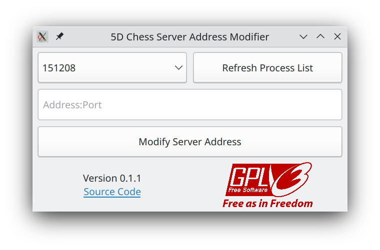

# **Unofficial** Tool for Modifying Server Address of [5D Chess With Multiverse Time Travel](https://store.steampowered.com/app/1349230/5D_Chess_With_Multiverse_Time_Travel/)



For Linux users, root permission may be required to access game memory.

## Build

Install Qt 5.

```sh
$ qmake
$ make debug
$ make release
```

Executable is located in `build/`.

## I18n

Built-in English, 简体中文 (Simplified Chinese) and 繁體中文 (Tradition Chinese) translations.

## License


## Dependencies

- [Qt](https://www.qt.io/) 5, licensed under GPLv3
